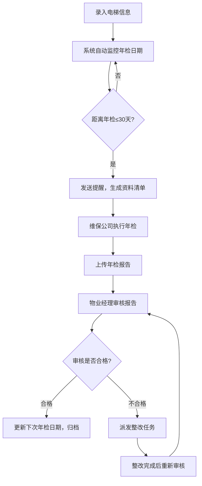

## 1. 产品概述
物业电梯年检管理系统，用于物业管理电梯信息、年检计划、维保报告和整改进度的全流程管理。
- 核心价值：确保电梯按时年检，降低安全风险，提升物业管理效率。
- 目标用户：物业管理人员、物业经理、维保公司人员。

## 2. 核心功能

### 2.1 用户角色

| 角色 | 注册方式 | 核心权限 |
|------|----------|----------|
| 物业管理员 | 系统分配 | 录入电梯信息、查看所有数据、管理维保单位 |
| 物业经理 | 系统分配 | 审核年检报告、安排整改任务、查看统计报表 |
| 维保公司 | 系统分配 | 上传年检报告、查看整改要求 |

### 2.2 功能模块

1. **仪表盘首页**：电梯概览统计、即将到期年检提醒、故障统计
2. **电梯管理**：电梯信息录入与维护
3. **年检提醒**：年检前自动提醒、资料准备清单
4. **报告审核**：维保公司上传报告、物业经理审核
5. **整改管理**：不合格整改任务派发与追踪
6. **故障记录**：电梯故障记录与查询
7. **维保单位管理**：维保公司信息维护

### 2.3 页面详情

| 页面名称 | 模块名称 | 功能描述 |
|-----------|-----------|---------------------|
| 仪表盘 | 统计卡片 | 电梯总数、即将年检、故障待审核、整改中 |
| 仪表盘 | 年检倒计时 | 按时间线展示即将到期的电梯 |
| 仪表盘 | 最近活动 | 最近故障记录、报告上传、整改更新 |
| 电梯管理 | 电梯列表 | 列表展示所有电梯，支持筛选搜索 |
| 电梯管理 | 电梯详情 | 查看电梯完整信息、故障历史、年检历史 |
| 电梯管理 | 新增/编辑电梯 | 录入楼栋、维保单位、下次年检日期等 |
| 年检提醒 | 提醒列表 | 自动生成年检提醒，展示需准备的资料清单 |
| 报告审核 | 待审报告 | 维保公司上传的待审核报告列表 |
| 报告审核 | 报告详情 | 查看报告内容、审核通过/驳回、填写审核意见 |
| 整改管理 | 整改任务列表 | 待整改、整改中、已完成的任务 |
| 整改管理 | 派发整改 | 分配整改责任人和截止日期 |
| 故障记录 | 故障列表 | 所有故障记录，支持筛选 |
| 故障记录 | 新增故障 | 录入故障时间、描述、处理情况 |
| 维保单位 | 单位列表 | 维保公司信息管理 |

## 3. 核心流程

电梯年检管理的主要流程：

## 4. 用户界面设计

### 4.1 设计风格
- **主色调**：深蓝 (#1e3a5f) 专业稳重，辅助色：橙色 (#f59e0b) 用于提醒和警告
- **按钮风格**：圆角矩形，简洁现代，hover 时有微妙的阴影变化
- **字体**：使用思源黑体 (Noto Sans SC) 作为主要字体
- **布局风格**：侧边栏导航 + 顶部状态栏 + 卡片式内容区域
- **图标风格**：使用 Lucide 图标库线性图标，简洁统一

### 4.2 页面设计概览

| 页面名称 | 模块名称 | UI元素 |
|-----------|-----------|---------|
| 仪表盘 | 统计卡片 | 深蓝色渐变背景，数字醒目统计卡片，渐入动画 |
| 电梯管理 | 电梯列表 | 表格布局，行 hover 高亮，搜索筛选栏 |
| 年检提醒 | 提醒列表 | 时间线式布局，按紧急程度颜色区分 |
| 报告审核 | 审核操作 | 报告预览区域 + 侧边操作面板 |
| 整改管理 | 任务卡片 | 状态标签，进度条，责任人头像 |

### 4.3 响应式设计
- 桌面端优先设计，适配 1280px 及以上
- 平板端：侧边栏可收起，内容自适应
- 移动端：顶部导航下拉菜单，卡片单列布局

### 4.4 交互动效
- 页面切换：淡入淡出过渡
- 数据加载：骨架屏占位动画
- 按钮/卡片：hover 状态阴影加深，微缩放
- 提醒通知：从右上角滑入，带轻微弹跳
