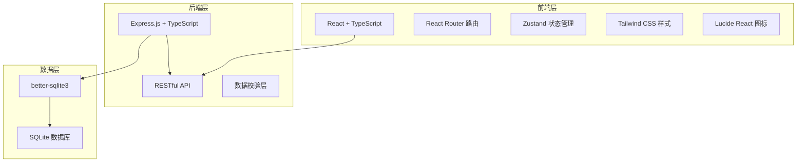
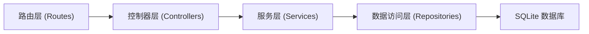
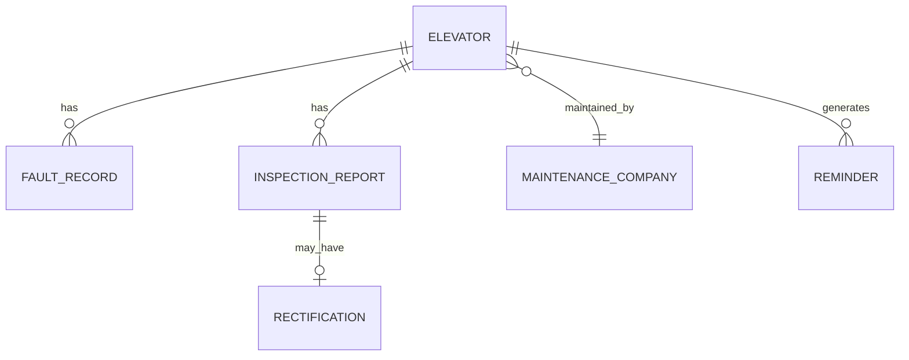

## 1. 架构设计



## 2. 技术说明
- **前端**：React@18 + TypeScript + Vite
- **状态管理**：Zustand
- **路由**：react-router-dom@6
- **样式**：Tailwind CSS@3
- **图标**：lucide-react
- **后端**：Express@4 + TypeScript
- **数据库**：SQLite (better-sqlite3)
- **初始化工具**：vite-init

## 3. 路由定义

| 路由 | 用途 |
|-------|------|
| / | 仪表盘首页 |
| /elevators | 电梯管理列表 |
| /elevators/:id | 电梯详情 |
| /elevators/new | 新增电梯 |
| /reminders | 年检提醒 |
| /reports | 报告审核 |
| /reports/:id | 报告详情 |
| /rectifications | 整改管理 |
| /faults | 故障记录 |
| /maintenance | 维保单位管理 |
| /maintenance/new | 新增维保单位 |

## 4. API 定义

### TypeScript 类型定义：

```typescript
// 电梯
interface Elevator {
  id: string;
  building: string;          // 楼栋编号
  floor: string;         // 楼层位置
  manufacturer: string;      // 生产厂家
  installDate: string;  // 安装日期
  maintenanceCompanyId: string;  // 维保单位ID
  nextInspectionDate: string;  // 下次年检日期
  status: 'normal' | 'maintenance' | 'fault';
  createdAt: string;
}

// 维保单位
interface MaintenanceCompany {
  id: string;
  name: string;
  contactPerson: string;
  contactPhone: string;
  address: string;
  createdAt: string;
}

// 年检报告
interface InspectionReport {
  id: string;
  elevatorId: string;
  companyId: string;
  reportDate: string;
  reportUrl: string;     // 报告文件URL
  content: string;       // 报告内容摘要
  status: 'pending' | 'approved' | 'rejected';
  reviewerId?: string;
  reviewComment?: string;
  reviewDate?: string;
  createdAt: string;
}

// 整改任务
interface Rectification {
  id: string;
  reportId: string;
  elevatorId: string;
  description: string;
  responsible: string;      // 责任人
  deadline: string;       // 截止日期
  status: 'pending' | 'in_progress' | 'completed';
  completionDate?: string;
  createdAt: string;
}

// 故障记录
interface FaultRecord {
  id: string;
  elevatorId: string;
  faultDate: string;
  description: string;
  handler: string;
  solution: string;
  status: 'open' | 'processing' | 'resolved';
  createdAt: string;
}

// 年检提醒
interface Reminder {
  id: string;
  elevatorId: string;
  type: '30days' | '15days' | '7days' | '1day';
  isRead: boolean;
  createdAt: string;
}
```

## 5. 服务端架构



## 6. 数据模型

### 6.1 实体关系图



### 6.2 数据库初始化语句

```sql
-- 维保单位表
CREATE TABLE IF NOT EXISTS maintenance_companies (
  id TEXT PRIMARY KEY,
  name TEXT NOT NULL,
  contact_person TEXT,
  contact_phone TEXT,
  address TEXT,
  created_at TEXT NOT NULL
);

-- 电梯表
CREATE TABLE IF NOT EXISTS elevators (
  id TEXT PRIMARY KEY,
  building TEXT NOT NULL,
  floor TEXT,
  manufacturer TEXT,
  install_date TEXT,
  maintenance_company_id TEXT,
  next_inspection_date TEXT NOT NULL,
  status TEXT NOT NULL DEFAULT 'normal',
  created_at TEXT NOT NULL,
  FOREIGN KEY (maintenance_company_id) REFERENCES maintenance_companies(id)
);

-- 故障记录表
CREATE TABLE IF NOT EXISTS fault_records (
  id TEXT PRIMARY KEY,
  elevator_id TEXT NOT NULL,
  fault_date TEXT NOT NULL,
  description TEXT NOT NULL,
  handler TEXT,
  solution TEXT,
  status TEXT NOT NULL DEFAULT 'open',
  created_at TEXT NOT NULL,
  FOREIGN KEY (elevator_id) REFERENCES elevators(id)
);

-- 年检报告表
CREATE TABLE IF NOT EXISTS inspection_reports (
  id TEXT PRIMARY KEY,
  elevator_id TEXT NOT NULL,
  company_id TEXT NOT NULL,
  report_date TEXT NOT NULL,
  report_url TEXT,
  content TEXT,
  status TEXT NOT NULL DEFAULT 'pending',
  reviewer_id TEXT,
  review_comment TEXT,
  review_date TEXT,
  created_at TEXT NOT NULL,
  FOREIGN KEY (elevator_id) REFERENCES elevators(id),
  FOREIGN KEY (company_id) REFERENCES maintenance_companies(id)
);

-- 整改任务表
CREATE TABLE IF NOT EXISTS rectifications (
  id TEXT PRIMARY KEY,
  report_id TEXT NOT NULL,
  elevator_id TEXT NOT NULL,
  description TEXT NOT NULL,
  responsible TEXT NOT NULL,
  deadline TEXT NOT NULL,
  status TEXT NOT NULL DEFAULT 'pending',
  completion_date TEXT,
  created_at TEXT NOT NULL,
  FOREIGN KEY (report_id) REFERENCES inspection_reports(id),
  FOREIGN KEY (elevator_id) REFERENCES elevators(id)
);

-- 提醒表
CREATE TABLE IF NOT EXISTS reminders (
  id TEXT PRIMARY KEY,
  elevator_id TEXT NOT NULL,
  type TEXT NOT NULL,
  is_read INTEGER NOT NULL DEFAULT 0,
  created_at TEXT NOT NULL,
  FOREIGN KEY (elevator_id) REFERENCES elevators(id)
);

-- 索引
CREATE INDEX IF NOT EXISTS idx_elevators_next_inspection ON elevators(next_inspection_date);
CREATE INDEX IF NOT EXISTS idx_reports_status ON inspection_reports(status);
CREATE INDEX IF NOT EXISTS idx_rectifications_status ON rectifications(status);
CREATE INDEX IF NOT EXISTS idx_reminders_unread ON reminders(is_read);
```
